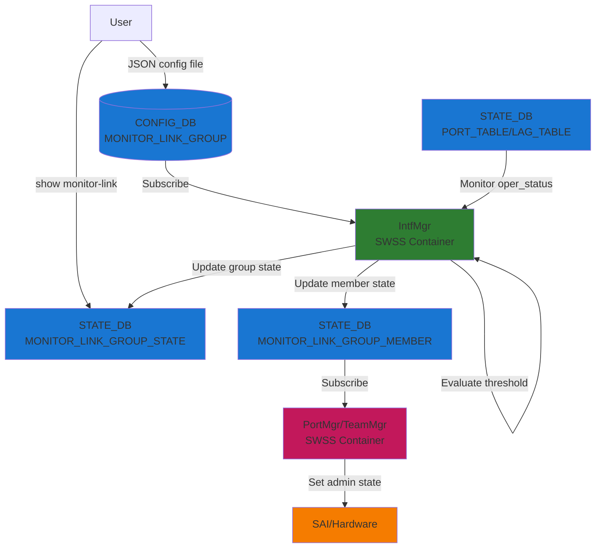
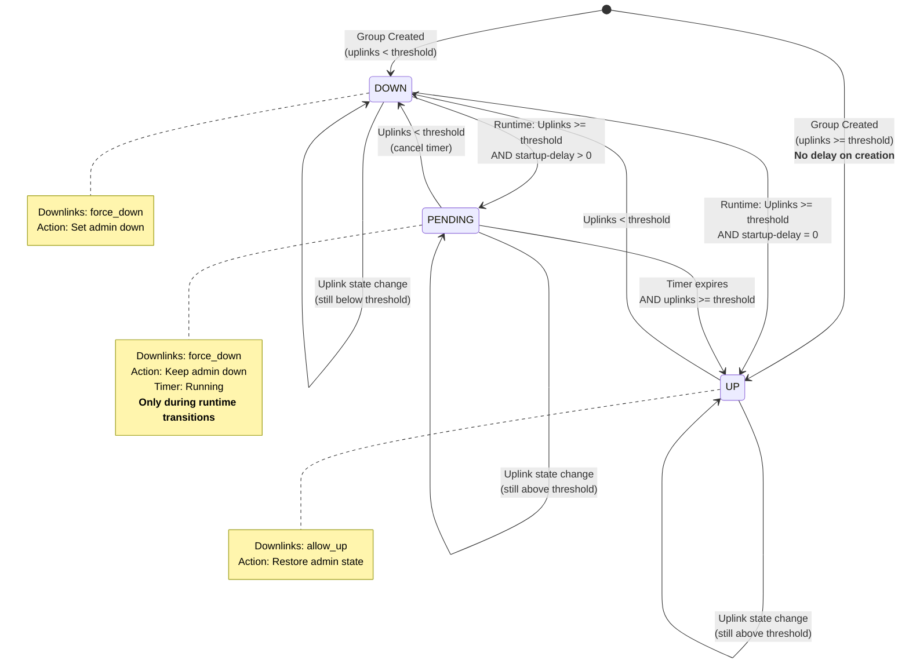
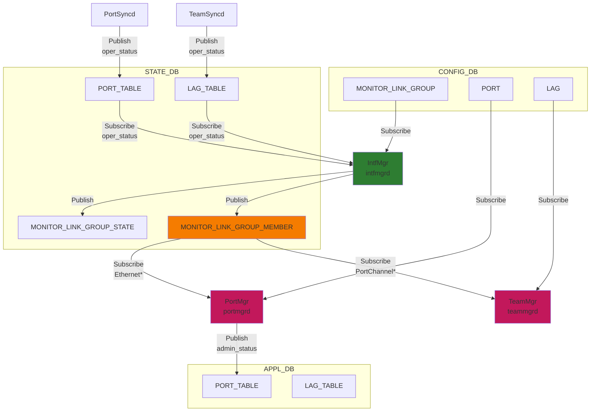
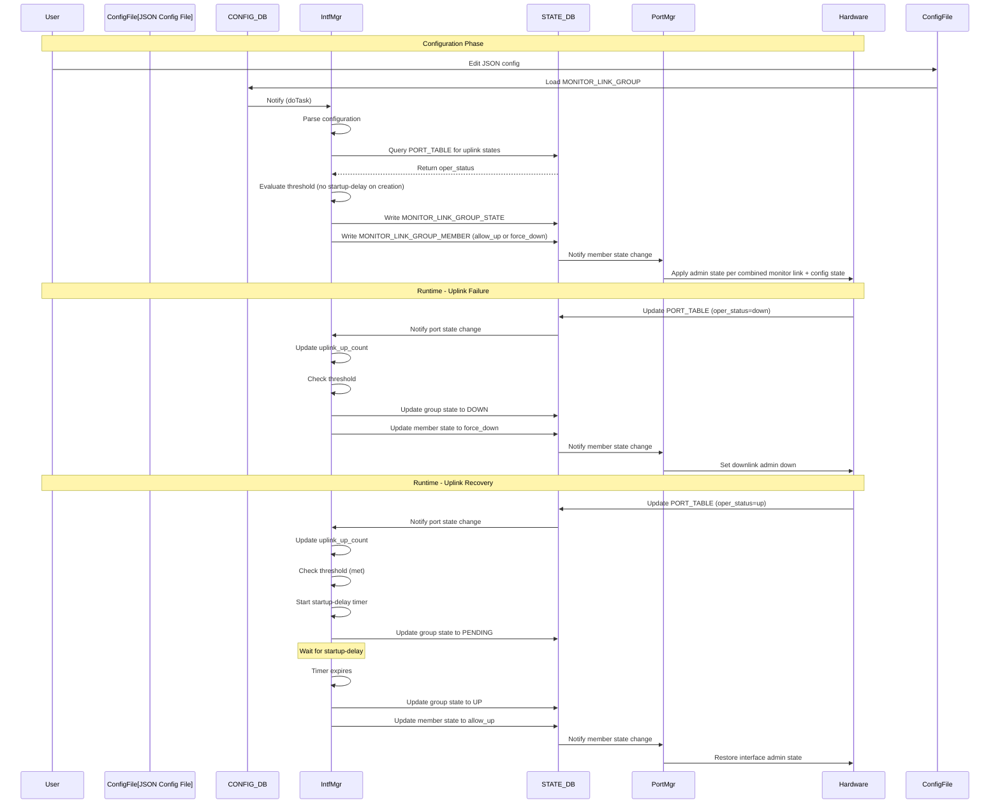

# Monitor Link Group High-Level Design

## Table of Content

- [1. Revision](#1-revision)
- [2. Scope](#2-scope)
- [3. Definitions/Abbreviations](#3-definitionsabbreviations)
- [4. Overview](#4-overview)
- [5. Requirements](#5-requirements)
- [6. Architecture Design](#6-architecture-design)
- [7. High-Level Design](#7-high-level-design)
- [8. SAI API](#8-sai-api)
- [9. Configuration and Management](#9-configuration-and-management)
- [10. Warmboot and Fastboot Design Impact](#10-warmboot-and-fastboot-design-impact)
- [11. Restrictions/Limitations](#11-restrictionslimitations)
- [12. Testing Requirements/Design](#12-testing-requirementsdesign)


## 1. Revision

| Rev | Date       | Author | Change Description |
|-----|------------|--------|-------------------|
| 0.1 | 2026-03-22 | SONiC  | Initial version   |

## 2. Scope

This document describes the Monitor Link Group feature in SONiC. The feature provides link state tracking functionality that allows downlink interfaces to be automatically disabled when a specified number of uplink interfaces go down, preventing traffic black-holing in network topologies where downlinks depend on uplinks for connectivity.

## 3. Definitions/Abbreviations

| Term | Definition |
|------|------------|
| Monitor Link Group | A logical grouping of uplink and downlink interfaces with defined tracking behavior |
| Uplink | An interface whose operational state is monitored |
| Downlink | An interface whose administrative state is controlled based on uplink status |
| min-uplinks | Minimum number of uplinks that must be operational for the group to be considered "up" |
| startup-delay | Time delay (in seconds) before bringing downlinks up after uplink threshold is met |

## 4. Overview

The Monitor Link Group feature implements link state tracking to prevent traffic black-holing in network scenarios where downstream interfaces depend on upstream connectivity. When the number of operational uplink interfaces falls below a configured threshold, the feature automatically brings down associated downlink interfaces. This ensures that traffic is not forwarded to downlinks when there is insufficient upstream connectivity.

The feature is particularly useful in:
- Multi-homed server deployments
- Aggregation layer switches
- Border leaf switches in data center fabrics
- Any topology where downlink forwarding depends on uplink availability

## 5. Requirements

### 5.1 Functional Requirements

1. Support grouping of interfaces into monitor link groups with uplinks and downlinks
2. Monitor operational status of uplink interfaces
3. Automatically control downlink interface states based on uplink availability
4. Support configurable minimum uplink threshold (min-uplinks)
5. Support configurable startup delay to prevent flapping
6. Allow interfaces to belong to multiple monitor link groups
7. Provide operational status visibility through show commands and STATE_DB
8. Support both physical Ethernet interfaces and PortChannel interfaces

### 5.2 Configuration Requirements

1. JSON configuration file format for monitor link groups
2. CONFIG_DB schema for persistent configuration
3. STATE_DB schema for operational state reporting
4. YANG model for configuration

### 5.3 Scalability Requirements

1. Support multiple monitor link groups per system
2. Support multiple interfaces per group
3. Minimal performance impact on interface state change processing

## 6. Architecture Design

The Monitor Link Group feature is implemented within the existing SONiC architecture without requiring architectural changes. The feature integrates with:

- **CONFIG_DB**: Stores monitor link group configuration
- **STATE_DB**: Stores operational state of groups and member interfaces
- **IntfMgr (SWSS)**: Core logic for monitoring and state management
- **PortMgr/TeamMgr**: Consumes downlink state changes to control interface admin status

### 6.1 System Architecture



### 6.2 State Machine Diagram



## 7. High-Level Design

### 7.1 Feature Type

This is a built-in SONiC feature implemented in the SWSS container.

### 7.2 Modified Components

**Repositories:**
- sonic-swss: IntfMgr implementation
- sonic-utilities: CLI commands and show commands
- sonic-yang-models: YANG model definition

**Modules:**
- `cfgmgr/intfmgr.cpp` and `cfgmgr/intfmgr.h`: Core monitor link logic
- `show/monitor_link.py`: CLI show commands
- `show/main.py`: CLI show command registration
- `yang-models/sonic-monitor-link-group.yang`: YANG model

### 7.3 Database Schema and Daemon Interactions

This section describes the complete database schema and how different daemons interact through Redis databases.

#### 7.3.1 CONFIG_DB Schema

**Table: MONITOR_LINK_GROUP**

```
Key: MONITOR_LINK_GROUP|<group_name>

Fields:
    "uplinks": <comma-separated list of interface names>
        - Example: "Ethernet64,Ethernet72"
        - Interfaces whose operational state is monitored

    "downlinks": <comma-separated list of interface names>
        - Example: "Ethernet80,PortChannel102"
        - Interfaces whose admin state is controlled

    "min-uplinks": <integer string, default: "1">
        - Minimum number of uplinks that must be operationally up
        - Group is UP when uplink_up_count >= min-uplinks

    "startup-delay": <integer string seconds, default: "0">
        - Delay before bringing downlinks up after threshold is met
        - Prevents flapping during uplink recovery

    "description": <string, optional>
        - Human-readable description of the group
```

#### 7.3.2 STATE_DB Schema

**Table: MONITOR_LINK_GROUP_STATE**

```
Key: MONITOR_LINK_GROUP_STATE|<group_name>

Fields:
    "state": <"up"|"down"|"pending">
        - "up": operational uplinks >= link_up_threshold AND startup-delay expired (or was 0)
        - "down": operational uplinks < link_up_threshold
        - "pending": operational uplinks >= link_up_threshold BUT waiting for startup-delay timer

    "uplinks": <comma-separated list>
        - Copy of configured uplink interfaces

    "uplinks_at_down": <comma-separated list>
        - Subset of uplinks currently reporting oper_status=down
        - Empty string when all uplinks are up
        - Useful for debugging which uplinks are causing the group to be DOWN/PENDING

    "downlinks": <comma-separated list>
        - Copy of configured downlink interfaces

    "link_up_threshold": <integer string>
        - Copy of min-uplinks from CONFIG_DB

    "link_up_delay": <integer string>
        - Copy of startup-delay from CONFIG_DB

    "description": <string>
        - Copy of description from CONFIG_DB
```


**Purpose:** This table is used **exclusively for operational visibility** through CLI show commands. It is NOT used by any daemon for functional logic. The actual control of downlink interfaces is performed through the `MONITOR_LINK_GROUP_MEMBER` table.

**Table: MONITOR_LINK_GROUP_MEMBER**

```
Key: MONITOR_LINK_GROUP_MEMBER|<interface_name>

Fields:
    "state": <"allow_up"|"force_down">
        - "allow_up": All groups containing this downlink are UP
        - "force_down": At least one group containing this downlink is DOWN/PENDING

    "down_due_to": <comma-separated list of group names>
        - List of groups currently forcing this interface down
        - Empty when state="allow_up"
        - Example: "critical_links,backup_links"
```

**Producer:** IntfMgr (intfmgrd)
**Consumer:** PortMgr (portmgrd) for Ethernet interfaces, TeamMgr (teammgrd) for PortChannel interfaces

**Table: PORT_TABLE** (existing table, monitored by IntfMgr)

```
Key: PORT_TABLE|<interface_name>

Fields (monitored):
    "oper_status": <"up"|"down">
        - Operational state of physical Ethernet interfaces

    "netdev_oper_status": <"up"|"down">
        - Network device operational state (alternative field)
```

**Producer:** PortSyncd, Kernel
**Consumer:** IntfMgr (for monitor link uplink state tracking)

**Table: LAG_TABLE** (existing table, monitored by IntfMgr)

```
Key: LAG_TABLE|<portchannel_name>

Fields (monitored):
    "oper_status": <"up"|"down">
        - Operational state of PortChannel interfaces
```

**Producer:** TeamSyncd, Teamd
**Consumer:** IntfMgr (for monitor link uplink state tracking)

#### 7.3.3 Daemon Interaction Flow

**1. IntfMgr (intfmgrd) - Central Orchestrator**

**Subscriptions:**
- `CONFIG_DB:MONITOR_LINK_GROUP` - Configuration changes
- `STATE_DB:PORT_TABLE` - Physical interface state changes
- `STATE_DB:LAG_TABLE` - PortChannel interface state changes

**Publications:**
- `STATE_DB:MONITOR_LINK_GROUP_STATE` - Group operational state
- `STATE_DB:MONITOR_LINK_GROUP_MEMBER` - Downlink control state

**Logic:**
```
On CONFIG_DB:MONITOR_LINK_GROUP change:
    1. Parse group configuration (uplinks, downlinks, threshold, delay)
    2. Query STATE_DB:PORT_TABLE and LAG_TABLE for current uplink states
    3. Calculate uplink_up_count
    4. Evaluate group state (UP/DOWN/PENDING)
    5. Write MONITOR_LINK_GROUP_STATE to STATE_DB
    6. For each downlink:
        - Calculate logical state (allow_up if ALL groups UP, else force_down)
        - Write MONITOR_LINK_GROUP_MEMBER to STATE_DB

On STATE_DB:PORT_TABLE or LAG_TABLE change:
    1. Update internal cache of interface operational state
    2. For each group containing this interface as uplink:
        - Update uplink_up_count
        - Re-evaluate group state
        - Update MONITOR_LINK_GROUP_STATE
        - Update MONITOR_LINK_GROUP_MEMBER for all downlinks in group
```

**2. PortMgr (portmgrd) - Ethernet Interface Controller**

**Subscriptions:**
- `CONFIG_DB:PORT` - Port configuration
- `STATE_DB:MONITOR_LINK_GROUP_MEMBER` - Monitor link control signals

**Publications:**
- `APPL_DB:PORT_TABLE` - Interface admin state changes

**Logic:**
```
On STATE_DB:MONITOR_LINK_GROUP_MEMBER change for Ethernet interface:
    - Reads the monitor link state (allow_up or force_down) and combines it
      with the configured admin_status from CONFIG_DB:PORT to determine the
      final admin state, then applies it to the interface.

On STATE_DB:MONITOR_LINK_GROUP_MEMBER DEL:
    - Restores interface to its configured admin_status from CONFIG_DB:PORT.
```

**3. TeamMgr (teammgrd) - PortChannel Interface Controller**

**Subscriptions:**
- `CONFIG_DB:LAG` - PortChannel configuration
- `STATE_DB:MONITOR_LINK_GROUP_MEMBER` - Monitor link control signals

**Publications:**
- None (applies admin state change directly to the netdev)

**Logic:**
```
On STATE_DB:MONITOR_LINK_GROUP_MEMBER change for PortChannel interface:
    - Reads the monitor link state (allow_up or force_down) and combines it
      with the configured admin_status from CONFIG_DB:LAG to determine the
      final admin state, then applies it to the interface.

On STATE_DB:MONITOR_LINK_GROUP_MEMBER DEL:
    - Restores PortChannel to its configured admin_status from CONFIG_DB:LAG.
```

#### 7.3.4 Database Interaction Diagram



### 7.4 Core Logic Flow

**IntfMgr Implementation:**

1. **Configuration Processing:**
   - IntfMgr subscribes to `CONFIG_DB:MONITOR_LINK_GROUP` table
   - On SET operation: Parse configuration, validate parameters, create/update group
   - On DEL operation: Remove group, clean up interface mappings, restore downlink states

2. **Interface State Monitoring:**
   - IntfMgr subscribes to `STATE_DB:PORT_TABLE` and `STATE_DB:LAG_TABLE`
   - Monitors `oper_status` and `netdev_oper_status` fields
   - Updates internal interface state cache when changes detected

3. **Group State Evaluation:**
   - When uplink state changes, update `uplink_up_count` for affected groups
   - Compare `uplink_up_count` against `min-uplinks` threshold
   - Determine group state: UP, DOWN, or PENDING

4. **Creation-Time vs Runtime Behavior:**

   **During Group Creation:**
   - If `uplink_up_count >= min-uplinks` at creation time, the group transitions to **UP immediately**
   - The `startup-delay` is **ignored** during initial group creation
   - Rationale: Avoid unnecessary delay when the network is already healthy at configuration time

   **During Runtime (Recovery from DOWN state):**
   - If `uplink_up_count >= min-uplinks` after being DOWN, the group transitions to **PENDING**
   - The `startup-delay` timer is started
   - Downlinks remain DOWN until the timer expires
   - Rationale: Prevent flapping by ensuring uplinks are stable before bringing downlinks up

5. **Threshold Logic:**
   ```
   // During group creation
   if (is_new_group and uplink_up_count >= min-uplinks):
       group_state = UP
       pending_up = false
       // No delay timer started

   // During runtime transitions
   else if (uplink_up_count >= min-uplinks):
       if (startup-delay > 0 and group was previously DOWN):
           group_state = PENDING
           start_delay_timer(startup-delay)
       else:
           group_state = UP
   else:
       group_state = DOWN
       cancel_delay_timer() if pending
   ```

6. **Downlink State Management:**
   - Each downlink maintains a `down_group_count` (number of groups forcing it down)
   - Downlink logical state: `should_be_up = (down_group_count == 0)`
   - Write to `STATE_DB:MONITOR_LINK_GROUP_MEMBER` with state and down_due_to list

7. **Delay Timer Handling:**
   - Uses `SelectableTimer` for startup-delay implementation
   - Timer callback transitions group from PENDING to UP
   - Timer is cancelled if threshold is no longer met during delay period

### 7.5 Detailed PortMgr/TeamMgr Interaction

PortMgr and TeamMgr are responsible for applying the monitor link control decisions made by IntfMgr. They subscribe to `STATE_DB:MONITOR_LINK_GROUP_MEMBER` and translate the logical state into actual interface admin state changes.

#### 7.5.1 PortMgr (Physical Ethernet Interfaces)

**Responsibility:** Controls admin state of physical Ethernet interfaces based on monitor link decisions

**Subscriptions:**
- `STATE_DB:MONITOR_LINK_GROUP_MEMBER` - Monitor link control signals
- `CONFIG_DB:PORT` - Port configuration (for admin_status)

**Processing Logic:**

When `STATE_DB:MONITOR_LINK_GROUP_MEMBER` is updated (SET operation):
1. Filter: Only process Ethernet interfaces (interface name starts with "Ethernet")
2. Parse `state` field from STATE_DB ("allow_up" or "force_down")
3. Parse `down_due_to` field (list of blocking groups)
4. Read configured `admin_status` from `CONFIG_DB:PORT`
5. Combine monitor link state with configuration:
   - `final_state = (monitor_link_state == "allow_up") AND (config_admin_up)`
6. Apply the final admin state via `setPortAdminStatus()`
7. Write to `APPL_DB:PORT_TABLE`

When `STATE_DB:MONITOR_LINK_GROUP_MEMBER` is deleted (DEL operation):
1. Monitor link control is removed
2. Read configured `admin_status` from `CONFIG_DB:PORT`
3. Restore interface to its configured state
4. Apply via `setPortAdminStatus()`

When `CONFIG_DB:PORT` `admin_status` is changed (SET operation):
1. If `admin_status="up"` and interface has an entry in `STATE_DB:MONITOR_LINK_GROUP_MEMBER`:
   - If monitor link state is `"force_down"`: block the admin-up, call `setPortAdminStatus(false)`
   - If monitor link state is `"allow_up"`: permit the admin-up, call `setPortAdminStatus(true)`
2. If `admin_status="up"` and interface has no monitor link entry: apply normally
3. If `admin_status="down"`: apply unconditionally regardless of monitor link state

This ensures a user cannot inadvertently override a monitor-link-imposed admin-down by changing the port configuration.

**Key Points:**
- PortMgr does NOT modify CONFIG_DB
- Admin state changes are applied via APPL_DB
- Configuration admin_status is preserved and restored when monitor link control is removed
- The `down_due_to` field is logged for debugging but not used in decision logic

#### 7.5.2 TeamMgr (PortChannel Interfaces)

**Responsibility:** Controls admin state of PortChannel (LAG) interfaces based on monitor link decisions

**Subscriptions:**
- `STATE_DB:MONITOR_LINK_GROUP_MEMBER` - Monitor link control signals
- `CONFIG_DB:LAG` - PortChannel configuration (for admin_status)

**Processing Logic:**

When `STATE_DB:MONITOR_LINK_GROUP_MEMBER` is updated (SET operation):
1. Filter: Only process PortChannel interfaces
2. Parse `state` field from STATE_DB ("allow_up" or "force_down")
3. Parse `down_due_to` field (list of blocking groups)
4. Read configured `admin_status` from `CONFIG_DB:LAG`
5. Combine monitor link state with configuration:
   - `final_state = (monitor_link_state == "allow_up") AND (config_admin_up)`
6. Apply the final admin state to the interface

When `STATE_DB:MONITOR_LINK_GROUP_MEMBER` is deleted (DEL operation):
1. Monitor link control is removed
2. Read configured `admin_status` from `CONFIG_DB:LAG`
3. Restore PortChannel to its configured state

When `CONFIG_DB:LAG` `admin_status` is changed (SET operation):
1. If `admin_status="up"` and interface has an entry in `STATE_DB:MONITOR_LINK_GROUP_MEMBER`:
   - If monitor link state is `"force_down"`: block the admin-up, call `setLagAdminStatus("down")`
   - If monitor link state is `"allow_up"`: permit the admin-up, call `setLagAdminStatus("up")`
2. If `admin_status="up"` and interface has no monitor link entry: apply normally
3. If `admin_status="down"`: apply unconditionally regardless of monitor link state

**Key Points:**
- TeamMgr handles PortChannel interfaces
- Uses `setLagAdminStatus()` which executes: `ip link set dev <portchannel> <up|down>`
- Configuration admin_status is preserved in CONFIG_DB:LAG
- When monitor link control is removed (DEL), interface returns to configured state

#### 7.5.3 State Combination Logic

Both PortMgr and TeamMgr use the same logic to combine monitor link state with configuration:

```
Final Admin State = (monitor_link_state == "allow_up") AND (config_admin_up)

Truth Table:
┌─────────────────────┬─────────────────┬──────────────────┐
│ monitor_link_state  │ config_admin_up │ Final Admin State│
├─────────────────────┼─────────────────┼──────────────────┤
│ force_down          │ up              │ DOWN             │
│ force_down          │ down            │ DOWN             │
│ allow_up            │ up              │ UP               │
│ allow_up            │ down            │ DOWN             │
└─────────────────────┴─────────────────┴──────────────────┘
```

This ensures:
1. Monitor link can force interfaces down even if configured as admin up
2. Monitor link cannot force interfaces up if configured as admin down
3. User configuration is always respected when monitor link allows the interface up

#### 7.5.4 Interaction Example

**Scenario:** Ethernet80 is a downlink in group "critical_links"

```
1. Initial State:
   CONFIG_DB:PORT|Ethernet80 = {"admin_status": "up"}
   STATE_DB:MONITOR_LINK_GROUP_MEMBER|Ethernet80 = {"state": "allow_up", "down_due_to": ""}
   → PortMgr sets Ethernet80 admin UP

2. Uplink Failure (group goes DOWN):
   IntfMgr updates:
   STATE_DB:MONITOR_LINK_GROUP_MEMBER|Ethernet80 = {"state": "force_down", "down_due_to": "critical_links"}
   → PortMgr receives notification
   → PortMgr combines force_down with config admin_status=up → final state: DOWN
   → Ethernet80 goes admin DOWN

3. Uplink Recovery (group goes UP after delay):
   IntfMgr updates:
   STATE_DB:MONITOR_LINK_GROUP_MEMBER|Ethernet80 = {"state": "allow_up", "down_due_to": ""}
   → PortMgr receives notification
   → PortMgr combines allow_up with config admin_status=up → final state: UP
   → Ethernet80 goes admin UP

4. Group Deletion:
   IntfMgr deletes:
   STATE_DB:MONITOR_LINK_GROUP_MEMBER|Ethernet80
   → PortMgr receives DEL notification
   → PortMgr restores Ethernet80 to configured admin_status=up
   → Ethernet80 returns to configured state
```

### 7.6 Multi-Group Support

An interface can belong to multiple monitor link groups:
- Downlink is forced down if ANY group it belongs to is DOWN/PENDING
- Downlink is allowed up only when ALL groups it belongs to are UP
- The `down_due_to` field lists all groups currently forcing the interface down

### 7.7 Sequence Diagram



### 7.8 Warmboot and Fastboot Dependencies

- Monitor link state is reconstructed from CONFIG_DB and STATE_DB after warmboot
- No impact on data plane during warmboot
- Delay timers are not persisted; groups in PENDING state transition to DOWN on restart

## 8. SAI API

This feature does not require any SAI API changes. The monitor link functionality is implemented entirely in the control plane by manipulating interface administrative states. The actual interface state changes are handled by existing SAI port APIs.

## 9. Configuration and Management

### 9.1 Configuration Method

**Configuration via JSON File:**

The monitor-link feature is configured through JSON configuration files loaded into CONFIG_DB. CLI commands for configuration are **not currently supported**.

**Configuration File Format:**

```json
{
    "MONITOR_LINK_GROUP": {
        "critical_links": {
            "uplinks": "Ethernet64,Ethernet72",
            "downlinks": "Ethernet80",
            "min-uplinks": "2",
            "startup-delay": "10",
            "description": "Critical uplink monitoring"
        }
    }
}
```

**Loading Configuration:**

```bash
# Load configuration from JSON file
sudo config load /etc/sonic/monitor_link_config.json -y

# Or apply via config reload
sudo config reload -y
```

**Show Commands:**

```bash
# Show all monitor link groups
show monitor-link

# Show specific group
show monitor-link <group_name>

# Example output:
Monitor Link Group: critical_links
==================================
Description:      Critical uplink monitoring
State:            UP
Uplinks Up:       2/2
Min-uplinks:      2
Startup-delay:    10 seconds
Total Interfaces: 3 (2 uplinks, 1 downlinks)

Interfaces:
--------------------------------------------------
Interface    Link Type    Status    Reason
-----------  -----------  --------  --------
Ethernet64   uplink       UP
Ethernet72   uplink       UP
Ethernet80   downlink     UP
```

**YANG Model (Future Enhancement):**

YANG model support for monitor-link configuration is planned for future releases. Currently, configuration is done through JSON files only.

Proposed YANG model structure for reference:

File: `sonic-monitor-link-group.yang`

```yang
module sonic-monitor-link-group {
    namespace "http://github.com/sonic-net/sonic-monitor-link-group";
    prefix monitor-link-group;

    container sonic-monitor-link-group {
        container MONITOR_LINK_GROUP {
            list MONITOR_LINK_GROUP_LIST {
                key "group_name";

                leaf group_name {
                    type string {
                        length "1..128";
                        pattern "[a-zA-Z0-9_-]+";
                    }
                }

                leaf-list uplinks {
                    type string {
                        pattern 'Ethernet([0-9]{1,3}|[1-9][0-9]{3})|PortChannel[0-9]+';
                    }
                }

                leaf-list downlinks {
                    type string {
                        pattern 'Ethernet([0-9]{1,3}|[1-9][0-9]{3})|PortChannel[0-9]+';
                    }
                }

                leaf description {
                    type string {
                        length "1..255";
                    }
                }

                leaf startup-delay {
                    type string {
                        pattern '[0-9]+';
                    }
                    default "0";
                    description "Time to elapse before bringing up the downlink";
                }

                leaf min-uplinks {
                    type string {
                        pattern '[0-9]+';
                    }
                    default "1";
                    description "Minimum number of uplinks that must be operational for the group to be considered up";
                }
            }
        }
    }
}
```

### 9.2 Config DB Enhancements

**Table: MONITOR_LINK_GROUP**

```json
{
    "MONITOR_LINK_GROUP": {
        "critical_links": {
            "uplinks": "Ethernet64,Ethernet72",
            "downlinks": "Ethernet80",
            "min-uplinks": "2",
            "startup-delay": "10",
            "description": "Critical uplink monitoring"
        },
        "backup_links": {
            "uplinks": "PortChannel101,PortChannel103",
            "downlinks": "PortChannel102",
            "min-uplinks": "1",
            "startup-delay": "5"
        }
    }
}
```

**Backward Compatibility:**
- New feature with no impact on existing configurations
- If CONFIG_DB does not contain MONITOR_LINK_GROUP entries, feature is inactive
- Existing interface configurations are not modified

## 10. Warmboot and Fastboot Design Impact

### 10.1 Warmboot Impact

The monitor link feature has minimal impact on warmboot:

1. **Configuration Persistence:** Monitor link group configuration is stored in CONFIG_DB and persists across warmboot
2. **Initialization Readiness Guard:** After restart, IntfMgr defers processing of `CONFIG_DB:MONITOR_LINK_GROUP` entries until it has received at least one `STATE_DB:PORT_TABLE` or `STATE_DB:LAG_TABLE` event. This ensures interface operational states are being tracked before group thresholds are evaluated. The `m_monitorLinkProcessingEnabled` flag is set on the first SELECT timeout after `m_interfaceStateReceived` becomes true.
3. **State Reconstruction:** After warmboot, IntfMgr reconstructs group state by:
   - Reading CONFIG_DB for group configuration
   - Querying STATE_DB for current interface operational states
   - Re-evaluating group thresholds and downlink states
4. **Delay Timer Handling:** Startup delay timers are not persisted. Groups in PENDING state before warmboot will transition to DOWN state after warmboot and re-evaluate based on current uplink states
5. **No Data Plane Impact:** Monitor link only affects control plane (interface admin states). No impact on data plane forwarding during warmboot

### 10.2 Fastboot Impact

Similar to warmboot, fastboot is not affected:
- Configuration is restored from CONFIG_DB
- Interface states are re-evaluated after system initialization
- No additional delays introduced to boot process

### 10.3 Performance Impact

- **No stalls/sleeps added to boot path:** Monitor link initialization is asynchronous
- **No CPU-heavy processing:** Simple threshold comparisons and state updates
- **No third-party dependencies:** Uses existing SONiC infrastructure
- **Service cannot be delayed:** Runs as part of swss container which is boot-critical

## 11. Restrictions/Limitations

1. **Interface Types:** Only Ethernet and PortChannel interfaces are supported
2. **Circular Dependencies:** Not validated - users must avoid circular uplink/downlink relationships
3. **Timer Precision:** Startup delay timer has ~1 second precision
4. **State Persistence:** Delay timer state is not persisted across reboots
5. **Configuration Validation:** min-uplinks should be ≤ total number of configured uplinks; no runtime enforcement is performed
6. **Platform Dependencies:** None - feature is platform-independent

## 12. Testing Requirements/Design

### 12.1 System Test Cases

System tests are implemented in the sonic-mgmt repository under `tests/monitor-link-group/`.

1. **Group Lifecycle Tests:**
   - Create monitor link group and verify state is UP
   - Create group with description
   - Remove group and verify it no longer exists
   - Create group with all uplinks already down; verify group and downlinks are DOWN

2. **Uplink Toggle Tests:**
   - Verify group stays UP when one uplink goes down (min_uplinks=1, 2 uplinks)
   - Verify group and downlinks go DOWN when all uplinks go down
   - Verify group and downlinks recover when an uplink comes back up

3. **Downlink Admin State Tests:**
   - Verify admin-down downlink stays down even when group is UP
   - Verify admin-down downlink stays down through group UP/DOWN transitions
   - Verify admin-enabled downlink comes back up when group is UP

4. **Link Management Tests:**
   - Add an uplink to a group and verify state
   - Remove an uplink from a group and verify state
   - Add a downlink to a group and verify state
   - Remove a downlink from a down group; verify removed link comes back up
   - Remove an entire down group; verify all downlinks are restored

5. **Multi-Group Tests:**
   - Three groups sharing the same uplinks: verify all go down together and recover together
   - Three groups sharing the same downlinks: verify downlinks go down when any group is down, and come up only when all groups are up
   - Remove a down group that shares downlinks with an up group; verify downlinks are restored

---

